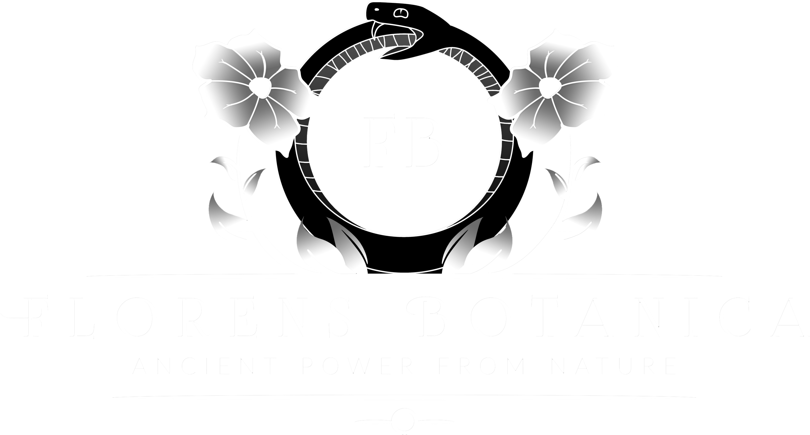

<h1 align="center">
  <br>
  
  <br>
  Florens Botanica
  <br>
</h1>

<h4 align="center">Egy gyógynövényekkel foglalkozó online áruház, ami segít az embereknek megismerni a természet gyógyító erejét.</h4>

<p align="center">
  <a href="#felhasznált-technológiák">Felhasznált technológiák</a> •
  <a href="#how-to-use">Használati útmutató</a> •
  <a href="#download">Letöltés</a> •
  <a href="#credits">Források</a> •
  <a href="#licenc">Licenc</a>
</p>

## Általános tudnivalók
&emsp;&emsp;A <b>Florens Botanica</b> a 13. évfolyamban sorra kerülő szakmai vizsga (<i>szoftverfejlesztő, -tesztelő</i> szakmán belül) keretein belül készült vizsgaremek, amely több, mint fél év fejlesztés gyümölcseként mutatkozik meg. 
<br><br>&emsp;&emsp;Úgy gondoljuk, hogy vizsgamunkánk minőségét a jól átgondolt, alapos tervezési fázisnak, a gondos fejlesztésnek és Tanáraink lelkes segítségének köszönhetjük.
## Felhasznált technológiák
* HTML
  - A weboldalak kialakítására
* JavaScript
  - A frontend interakcióinak megvalósítására
* CSS / SCSS
  - A frontend formázására
* PHP
  - A backend megvalósítására (adatbázis-kezelés, session kezelés)
* SQL
  - Az adatbázis megvalósítására
* XAMPP
  - A lokális szerver futtatására
* Python
  - Az alkalmazás tesztelésére és a dinamikus tartalmak kezelésére
## Használati útmutató

Az alkalmazás klónozásához és használatához szükséged lesz a [Git](https://git-scm.com) és a [Node.js](https://nodejs.org/en/download/) (ami az [npm-hez](http://npmjs.com) tartozik) telepítésére. A konzolba az alábbi sorokat kell írnod:

```bash
# A repository klónozása
$ git clone https://github.com/M-Csanad/13c-vizsgaprojekt/

# Belépés a repositoryba
$ cd 13c-vizsgaprojekt

# Függőségek telepítése
$ npm install

# Alkalmazás elindítása (Futó XAMPP)
$ npm start
```
## Letöltés

Az alkalmazásunk legfrissebb verzióját [erről a linkről](https://github.com/M-Csanad/13c-vizsgaprojekt/releases) tudod letölteni.

## Források

Az alkalmazásunk az alábbi forrásokat használja:

- [Node.js](https://nodejs.org/)
<h4>Képek</h4>

- [Mountain Rose Herbs](https://mountainroseherbs.com/)
- [Anima Mundi Herbals](https://animamundiherbals.com/)
- [ManuTea](https://www.manutea.hu/)


## Licenc

A projekt egy iskolai projekt céljából készült, a forráskód bármilyen formában történő publikálása, szerkesztése, másolása a készítők engedélye nélkül tilos.

---

> Blank Máté Norman &nbsp;&middot;&nbsp;
> GitHub [@mxte-b](https://github.com/mxte-b) &nbsp;&middot;&nbsp;
> E-mail [13c-blank@ipari.vein.hu](mailto:13c-blank@ipari.vein.hu)

> Milkovics Csanád &nbsp;&middot;&nbsp;
> GitHub [@M-Csanad](https://github.com/M-Csanad) &nbsp;&middot;&nbsp;
> E-mail [13c-milkovics@ipari.vein.hu](mailto:13c-milkovics@ipari.vein.hu)

